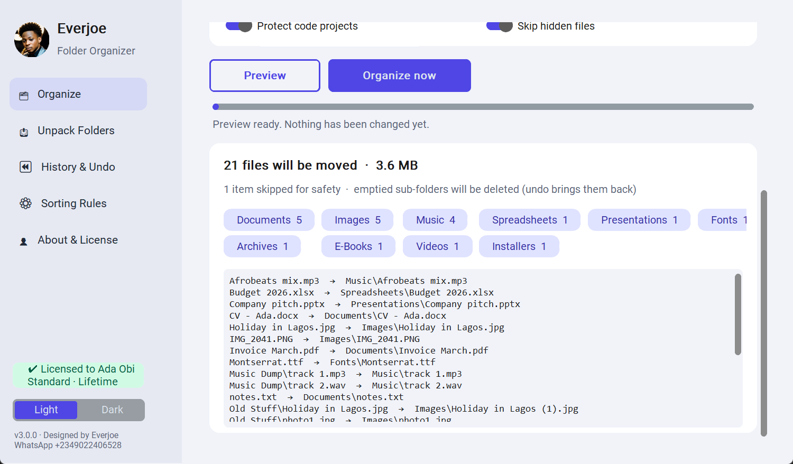
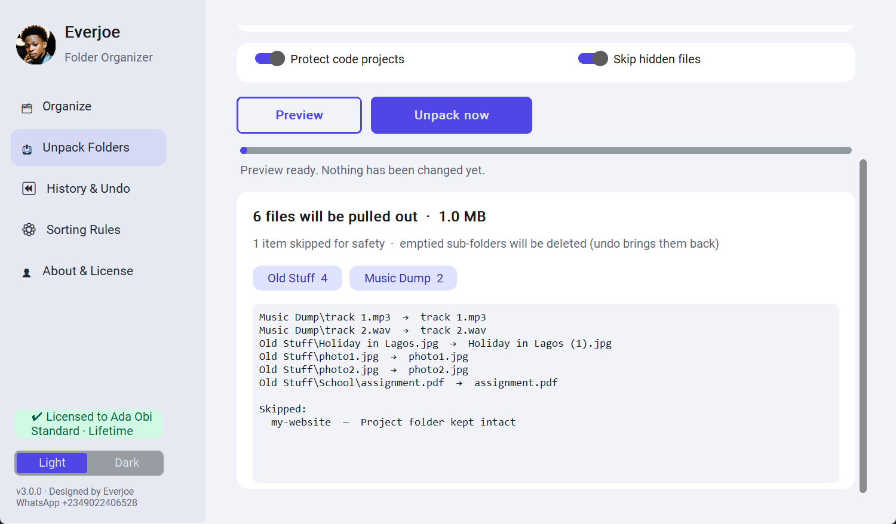
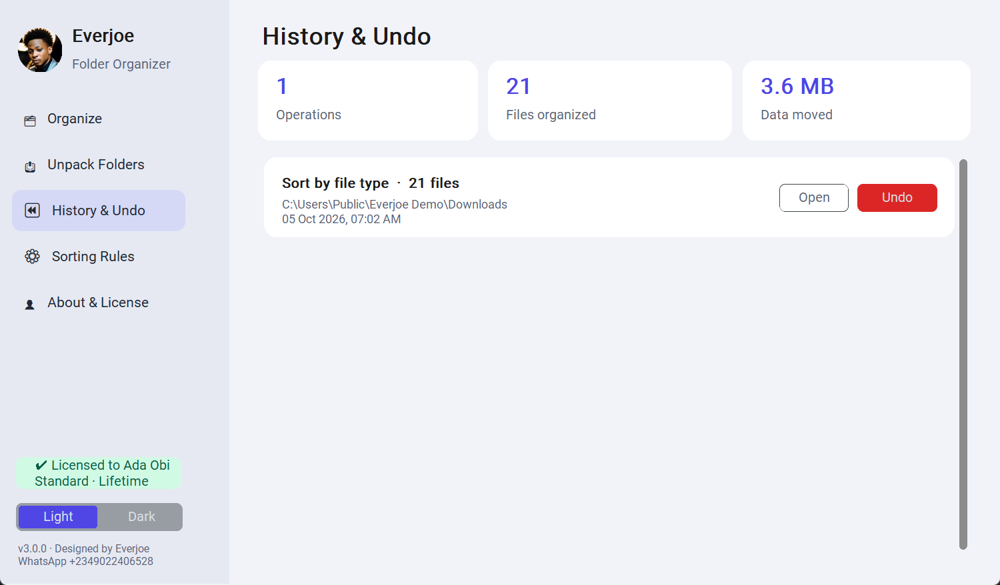
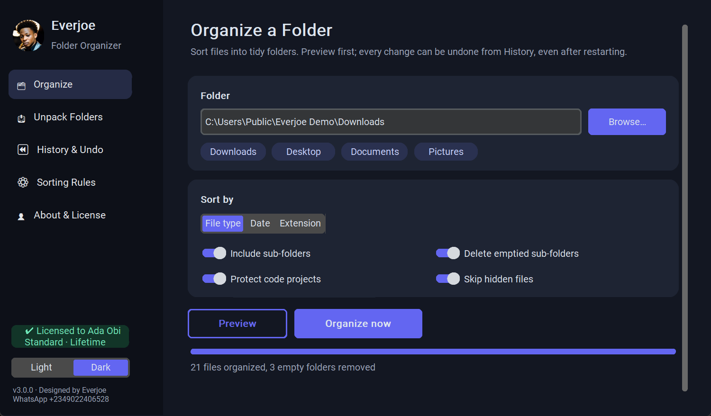
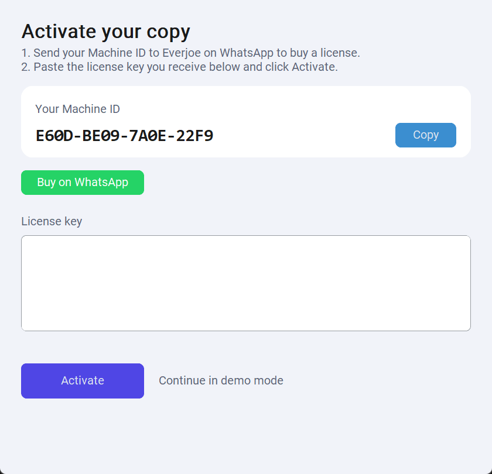

# Everjoe Folder Organizer

**Messy folders, sorted in seconds.** Everjoe Folder Organizer moves the files in your Downloads, Desktop or Documents folder into neat folders (Images, Documents, Music, Videos and more). You preview everything first, and you can undo anytime.

## ⬇️ Download (Windows 10 / 11)

| | |
|---|---|
| **[Download the app + User Guide (.zip)](https://github.com/Everjoegr8/everjoe-organizer-downloads/releases/latest/download/EverjoeOrganizer-Customer-Package.zip)** | Recommended |
| [Just the app (.exe)](https://github.com/Everjoegr8/everjoe-organizer-downloads/releases/latest/download/EverjoeOrganizer.exe) | No install needed |
| [User Guide (PDF)](https://github.com/Everjoegr8/everjoe-organizer-downloads/releases/latest/download/Everjoe-Organizer-User-Guide.pdf) | Step-by-step, with pictures |
| [All versions](https://github.com/Everjoegr8/everjoe-organizer-downloads/releases) | Release history |

> If Windows says *"Windows protected your PC"*, click **More info → Run anyway**.

## Features

- 🗂 **Sort by file type, date or extension**
- 📤 **Unpack folders**: pull every file out of sub-folders, then delete the empty folders
- 👀 **Preview first**: nothing moves until you say so
- ⏪ **Undo anytime**: every job is saved in History, even after a restart
- 🛡 **Safe**: never touches Windows folders, code projects, hidden files or unfinished downloads, and never overwrites a file
- ⚙ **Your own rules**, light & dark mode, and a right-click "Organize with Everjoe" option

| Unpack Folders | History & Undo | Dark mode |
|---|---|---|
|  |  |  |

## Get a license

The download is a free **demo** (it previews everything). To organize files:

1. Open the app → **Activate** → **Buy on WhatsApp** (your Machine ID is included automatically).
2. Pay, and receive your license key.
3. Paste the key and click **Activate**.

**Contact:** [WhatsApp +234 902 240 6528](https://wa.me/2349022406528)

---

Designed & developed by **Everjoe**. Proprietary software, see [EULA.txt](EULA.txt). This repository only hosts the downloads.
